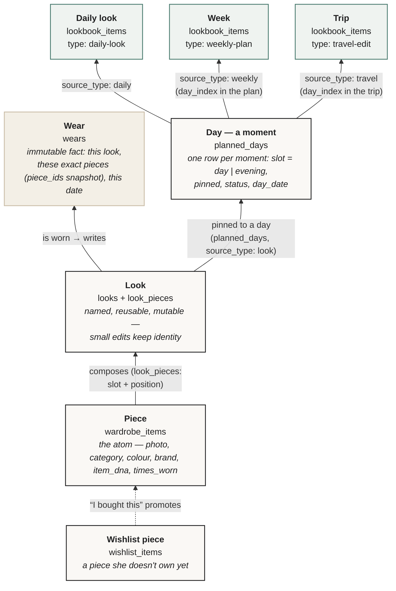
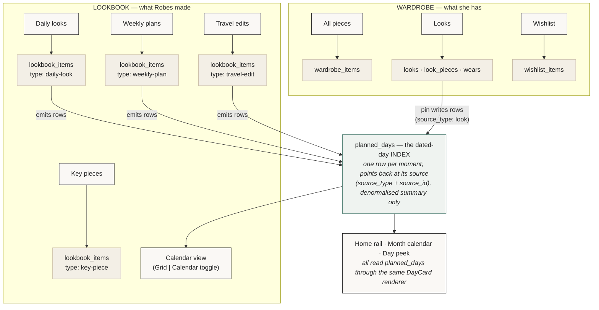
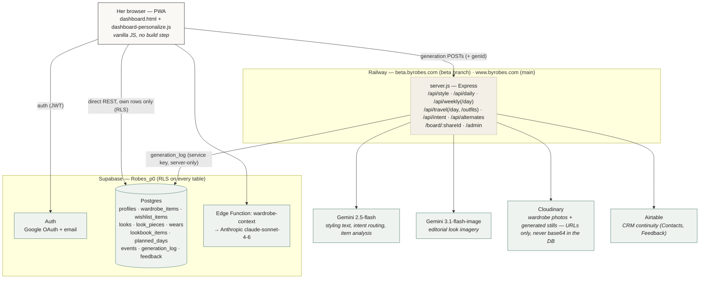

# Robes — System Architecture & Object Model

*2026-07-30 · Grounded in the live schema on `Robes_p0` (migrations 1–14) and the `beta` branch code. Every label below is the real table / type name — nothing renamed for the diagram.*

The purpose of this document is a single shared picture of how the objects connect — a piece to a look, a look to a day, a day to a week or a trip — and which container owns what, so every new feature lands on the same spine instead of growing a parallel one.

---

## 1. The object model — one spine, four levels

The hierarchy is **Piece → Look → Day (moment) → Plan (Week / Trip)**. Each level composes the one below it and never re-implements it.



**Reading the spine:**

- A **Piece** (`wardrobe_items`) is the atom. Everything above it references pieces by id — nothing ever copies garment data upward except as an explicit snapshot.
- A **Look** (`looks`) is the saved, named, reusable entity. Its *current* composition lives in `look_pieces` (look_id + wardrobe_item_id + slot + position). Identity is the **exact piece set** — never a similarity threshold. Editing a look with history goes through the explicit promotion gate (Update this look / Save as new — `origin_look_id` + `source: 'variant'` on the promoted row).
- A **Wear** (`wears`) is an immutable fact: `{look_id, piece_ids snapshot, worn_on}`. There is deliberately **no update policy** on the table and a unique `(user_id, look_id, worn_on)` — corrections are delete-and-recreate, so the count "wear more, buy less" is measured on can't be inflated or silently rewritten.
- A **Day** is a *moment*, not a date: `planned_days` holds one row per `(source, day_index, slot)` with `slot ∈ {day, evening}`. Two plans may claim the same date — precedence is resolved at **read time** (`look` pin > `daily` > `travel` > `weekly`, ties to latest `updated_at`), never by write-time exclusion.
- A **Week** and a **Trip** are the same object with different constraints — one `lookbook_items` row whose `data` blob (`wkData` / `tvData`) is authoritative for rendering, configured per track via `_RB_TRACKS`. The one deliberate structural difference: **on a trip you dress from a case (the capsule), not the wardrobe**.

Three objects, never one: the **Look** (the thing), the **Wear** (the occasion it happened), and the **DayCard** (the presentation) are separate on purpose. That separation is what lets "does changing the shoes create a new look?" dissolve instead of becoming a bug.

---

## 2. The containers — Wardrobe vs Lookbook

Two top-level containers with a clean ownership rule: **Wardrobe holds what she has. Lookbook holds what Robes made with it.**



**Why this scales:**

- The Wardrobe's three tabs are three *different entities* (pieces, looks, wishlist), not three filters over one table. Promotion between them is explicit ("I bought this" copies a wishlist row into `wardrobe_items`; a wear accrues a Look).
- The Lookbook's four types are **one table, one `type` column** (`lookbook_items`, unconstrained text) — a new artifact type needs no migration, and every artifact gets sync, share (`share_id` / `is_public` → `/board/:shareId`), rename, and delete for free.
- `planned_days` is an **index, never a replacement**: the plan blobs stay authoritative for rendering; the index carries just enough denormalised summary (`activity`, `headline`, `thumb_urls`, `item_ids`) to paint a rail card or a month cell without parsing any blob. Every calendar surface — home rail, month view, day peek, deep links — reads this one index through the one `window._rbOpenPlannedDay` spine.

---

## 3. The data model — real tables, real keys

```mermaid
erDiagram
    profiles ||--o{ wardrobe_items : "owns"
    profiles ||--o{ wishlist_items : "saves"
    profiles ||--o{ looks : "owns"
    profiles ||--o{ lookbook_items : "keeps"
    profiles ||--o{ planned_days : "plans"

    wardrobe_items ||--o{ look_pieces : "appears in"
    looks ||--o{ look_pieces : "current composition"
    looks ||--o{ wears : "worn as (immutable)"
    looks |o--o{ looks : "origin_look_id (variant promotion, no cascade)"
    lookbook_items ||--o{ planned_days : "source_id (text pointer, no FK — by design)"
    wishlist_items }o--|| wardrobe_items : "promoted on purchase"

    profiles {
        uuid id PK
        text first_name
        jsonb style_dna
        text gender_identity
        timestamptz onboarded_at
        boolean is_admin
    }
    wardrobe_items {
        uuid id PK
        uuid user_id FK
        text label
        text category
        text image_url
        int times_worn
        jsonb item_dna
        int hero_position
        text seasons
    }
    looks {
        uuid id PK
        uuid user_id FK
        text name
        boolean name_provisional
        text note
        text photo_url
        text source
        uuid origin_look_id
    }
    look_pieces {
        uuid look_id PK_FK
        uuid wardrobe_item_id PK_FK
        text slot
        smallint position
    }
    wears {
        uuid id PK
        uuid look_id FK
        date worn_on
        uuid_array piece_ids "SNAPSHOT - history stays truthful"
        text source
        text source_id
    }
    lookbook_items {
        bigint id PK "client Date.now(); PK is (user_id, id)"
        uuid user_id PK_FK
        text type "key-piece | daily-look | weekly-plan | travel-edit | moodboard"
        text title
        jsonb data "kpData / dlData / wkData / tvData — authoritative blob"
        text share_id
        boolean is_public
    }
    planned_days {
        uuid id PK
        uuid user_id FK
        date day_date "local calendar date"
        text source_type "daily | weekly | travel | look"
        text source_id "no FK - rows can be local-only"
        int day_index
        text slot "day | evening (check-capped at 2)"
        boolean pinned
        text status "planned | free | worn | swapped"
        jsonb thumb_urls
        jsonb item_ids
    }
    wishlist_items {
        uuid id PK
        uuid user_id FK
        text source_type "robes | instagram | substack | screenshot | url | photo"
    }
```

Deliberate key decisions worth naming, because they look like omissions and aren't:

| Decision | Why |
|---|---|
| `planned_days.source_id` is **text with no FK** | The lookbook PK is composite `(user_id, id)` and rows can exist local-only before sync. Orphans are handled by explicit sweeps (`_pdDeleteSource` on delete) instead of cascades. |
| `wears` has **no update policy** | A confirmed wear is evidence. Evidence that can be edited in place isn't. Undo is a DELETE. |
| `wears.piece_ids` is a **snapshot array**, not a join | A look worn in sandals, later edited to slides, must keep showing the sandals in that wear's history. |
| `looks.origin_look_id` has **no cascade** | Deleting an ancestor look must not take its promoted variants with it. |
| Uniqueness on `planned_days` is the **moment** `(user_id, source_id, day_index, slot)`, not the date | Two plans may legitimately claim a date; precedence is a read-time question. Write-time exclusion loses data. |
| `slot` is check-capped at two values in the database | A third moment per day is a product decision with a migration attached, not something a client can drift into. |

---

## 4. The platform around the objects



The division of labour: the **client talks to Supabase directly** for everything that is hers (CRUD on her own rows, RLS-enforced), and to **Express only for generation** (which fans out to Gemini and logs every call to `generation_log` under one `gen_id` per prompt — her typed words → each LLM call → the saved artifact, traceable end to end in `/admin`).

---

## 5. The rules that keep it scalable

These are the standing conventions already enforced in the codebase — the diagram above only stays true as long as these hold.

1. **One renderer per concept.** Any surface that draws a look composes `window._rbLookTile`; any surface that draws a day composes the DayCard (`_dcCard`); every generated console renders through `_rbConsole`. Two components rendering the same content on different surfaces is how divergence starts — it is banned by handoff rule, not preference.
2. **Blobs are authoritative, the index derives.** `planned_days` (and any future index) is rebuilt from the source blobs through the same row builders the strips use (`_pdRowsWk` / `_pdRowsTv` / `_pdRowsDl`). One shape, no freshness gap.
3. **Precedence at read time, coexistence at write time.** Re-planning the same dates never deletes competing rows; the reader resolves per `(date, slot)` — pinned look > daily > travel > weekly — and same-type supersession (`_pdSupersede`) drops a re-planned trip's ghost wholesale.
4. **Identity is explicit.** A Look is its exact piece set; a variant is a new row only when she says so; a Wear is frozen at confirmation. No inference, no similarity thresholds, no silent mutation of anything with history.
5. **Every new track rides the config, not a fork.** `_RB_TRACKS` (weekly / travel / daily) is the one config object — the fourth-track proof (a "retreat" track through the weekly engine with zero component changes) is the scalability test for the plan layer, already harness-verified.
6. **Degrade, never block.** Every table added since launch (wishlist, planned_days, looks) no-ops gracefully when its migration hasn't run — the app must never hard-depend on the newest table.

### Known seams (watch list, not debt to panic about)

- **Weekly/travel days live inside the plan blob**, not as first-class look rows — a day's outfit has position, not identity. The Looks entity (migration 14) is the landing zone if cross-plan look identity is ever needed; passive accrual (`__lkAccrue`) is already the bridge.
- **Two id schemes coexist**: `lookbook_items` uses client `Date.now()` bigints (composite PK with user_id); the entity tables use uuids. `_rbOpenPlannedDay` already branches on this (uuid → Look detail, numeric → lookbook). Fine at current scale; unify only if artifacts ever need server-side minting.
- **`lookbook_items.data` is a jsonb monolith per artifact.** Right trade-off for render-authoritative documents; if any field inside it ever needs querying across users, promote it to a column or an index table (exactly what `planned_days` did for dates) rather than parsing blobs.
